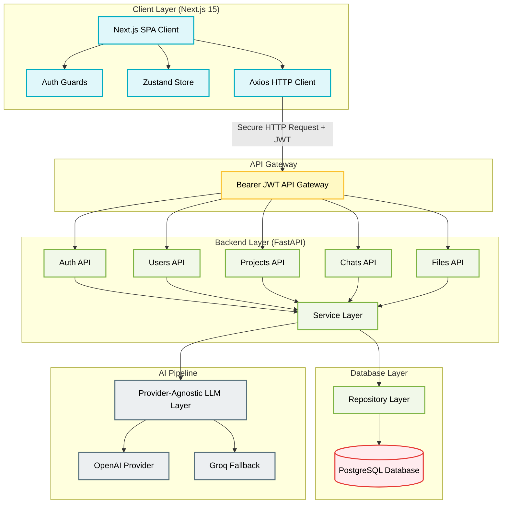

# Yellow.ai Enterprise AI Platform — Detailed Architecture & Design Explanation

This document provides an exhaustive explanation of the Yellow.ai Enterprise AI Platform architecture, detailing the high-level system layers, core quality attributes, component interactions, and a complete user flow walkthrough from landing to logging out.

---

## 1. Detailed High-Level Architecture

The platform follows a modern, decoupled **Client-Server Architecture** utilizing a stateless FastAPI backend and a Next.js Single Page Application (SPA) frontend.



### Architectural Layers Explained

#### A. Client Layer (Next.js 15)
* **Auth Guarding**: Route middleware (`AuthGuard.tsx`) wraps protected pages, inspecting client-side credentials. It intercepts unauthorized attempts and redirects users to `/login`.
* **State Management (Zustand)**: Serves as a single source of truth for the client. Zustand handles active state (active project details, current conversations, current messages array) to avoid prop drilling and prevent page re-renders.
* **Axios Interceptors**: Automatically attaches the active JWT Bearer token to all outgoing request headers. It also catches global HTTP errors (e.g., `401 Unauthorized`) to clear stale credentials.

#### B. API Gateway / Routing Layer (FastAPI)
* **Router Routing**: FastAPI routes incoming traffic to specialized sub-routers (Auth, Projects, Chat, Files).
* **Dependency Injection**: Enforces security at the route level via dependencies like `get_current_user`. This intercepts the Bearer Token, validates the signature, extracts user claims, and rejects unauthorized traffic before it reaches logic blocks.

#### C. Service Layer (Business Logic)
* **Decoupled Engines**: Services (e.g., `projectService`, `chatService`, `fileService`) execute multi-step operations, coordinate with repositories for persistence, and communicate with external services (like OpenAI/Groq APIs).
* **Provider-Agnostic LLM Layer**: Implements a standard wrapper interface (`BaseLLMProvider`). This enables the chat engine to query models transparently, passing system instructions and files context uniformly.

#### D. Repository & Database Layer (Persistence)
* **Data Access Objects**: Repositories isolate SQL execution using SQLAlchemy ORM. They abstract queries, transactions, and filters, preventing database leaking into the business layer.
* **Database**: Serverless PostgreSQL handles transactional consistency. Primary tables (Users, Projects, Conversations, Messages, Prompts, Files) are highly normalized and query-optimized with index trees.

---

## 2. Core Architectural Qualities & Implementation Strategies

### ● Scalability
* **Stateless API Routing**: The FastAPI server doesn't retain session states. This enables the service to scale horizontally across multiple container nodes (e.g., in a Kubernetes or Docker swarm setup) without synchronization issues.
* **Database Concurrency**: The SQLAlchemy repository layer utilizes asynchronous database transactions, enabling single threads to manage thousands of concurrent active connections without blocking.

### ● Security
* **Owner-Based Verification Bounds**: A primary attack vector in multi-tenant environments is ID tampering (accessing resource A with owner B's credentials). The platform solves this by checking the resource owner ID against the user ID decrypted from the JWT on *every* read, update, or delete request.
* **Data Transit & Resting Cryptography**: All REST APIs utilize TLS/HTTPS. Passwords undergo bcrypt cryptographic hashing inside the backend before database writing.

### ● Extensibility
* **LLM Polymorphism**: Adding new models is straightforward. You write a subclass of `BaseLLMProvider` implementing `generate_response()`, and modify the backend configuration. The rest of the pipeline remains unchanged.
* **Loose Component Coupling**: Adding an analytics dashboard or user usage audit logger requires creating a new service file and linking it. The database schema's relative isolation makes adding secondary tables simple.

### ● Performance
* **Sub-Second Groq Engine**: Using Groq's high-speed inference engine ensures users receive near-instant responses.
* **Query Index Trees**: Common search queries (e.g., loading conversation history by `project_id`) are indexed. This minimizes SQL execution time.

### ● Reliability
* **Self-Healing LLM Pipeline**: When the primary OpenAI provider fails (e.g., due to rate limits or key issues), a try-except block automatically invokes Groq, logging the failure for analysis without breaking the user's session.
* **Unified Payload Verification**: Pydantic validates incoming schemas. If a client transmits malformed payload data, the API halts execution at the gateway boundary, avoiding database corruption.

---

## 3. End-to-End User Flow & Component Interaction

The table below traces the lifecycle of a user action, showing how each component behaves as the user progresses through the system:

```mermaid
graph LR
    classDef action fill:#E0F7FA,stroke:#00ACC1,stroke-width:2px,color:#000000;
    classDef fe fill:#FFF9C4,stroke:#FBC02D,stroke-width:2px,color:#000000;
    classDef gw fill:#F1F8E9,stroke:#7CB342,stroke-width:2px,color:#000000;
    classDef service fill:#FFEBEE,stroke:#E53935,stroke-width:2px,color:#000000;
    classDef ext fill:#ECEFF1,stroke:#546E7A,stroke-width:2px,color:#000000;

    UserAction[User Action]:::action -->|Triggers| Frontend[Frontend Components & Zustand]:::fe
    Frontend -->|HTTP Request + JWT| Gateway[FastAPI API Gateway]:::gw
    Gateway -->|Coordinates Logic| ServicesRepos[Service & Repository Layer]:::service
    ServicesRepos -->|Persistent Query / API Call| DB_AI[Database & AI Provider APIs]:::ext
```



| Phase & User Action | Frontend Component Movement | Backend API Gateway Movement | Service & Repo Layer Execution | Database & AI Provider Interaction |
| :--- | :--- | :--- | :--- | :--- |
| **1. Registration**<br>User submits signup form with email and password. | Form validates inputs (Zustand/Zod). Axios submits POST payload to `/auth/register`. | FastAPI validates payload schema using Pydantic. Passes call to `AuthService`. | `AuthService` hashes the password using Bcrypt and invokes `UserRepository`. | `UserRepository` inserts user record into `users` table. Returns success payload. |
| **2. Login**<br>User enters credentials. | Axios sends POST to `/auth/login`. On success, stores JWT token in `localStorage`, updates Zustand auth state, redirects user to `/projects`. | API verifies credentials. Generates signed JWT payload containing `user_id` and token expiry. | `AuthService` verifies password matches database hash using `UserRepository`. | Reads user credentials from database. |
| **3. Project Workspace Setup**<br>User views dashboard and creates a new project project. | UI checks `AuthGuard` status. Renders projects lists. User clicks "Create Project". POST request dispatched to `/projects`. | `get_current_user` extracts JWT claims, validating user identity. Route directs payload to `ProjectService`. | `ProjectService` maps the project to the extracted `user_id` and calls `ProjectRepository`. | Inserts project details (name, specs) into `projects` table. |
| **4. Attaching Knowledge Base Files**<br>User opens a project workspace and uploads a reference document. | User drags file to `FileUploader`. Dispatches multipart POST request to `/projects/{id}/files`. Renders loading status. | Gateway validates project path ownership via JWT dependency. Sends binary stream to `FileService`. | `FileService` processes file stream, registers it to provider (if using OpenAI files), and passes metadata to `FileRepository`. | Stores record in `files` table, linking metadata (filename, provider_file_id) to the `project_id`. |
| **5. Configuring System Instructions**<br>User updates instructions to dictate AI assistant behavior. | User updates instructions in `PromptEditor`. Dispatches PUT request to `/projects/{id}/prompt`. | Validates ownership checks. Route redirects payload instructions to `PromptService`. | `PromptService` coordinates database updates via `PromptRepository` using a unique constraint lookup on `project_id`. | Inserts or updates instructions in the `prompts` table. |
| **6. Starting a Chat & AI Generation**<br>User types a message in the project chat. | Message input dispatches POST message payload to `/chat/messages` with `conversation_id`. UI renders animated bouncing Bot logo and pulsing "thinking..." text. | Gateway verifies conversation ownership via active token parameters. Directs payload to `ChatService`. | `ChatService` fetches: <br>1. Chat history<br>2. Project system prompts<br>3. Uploaded files<br><br>Compiles context and sends it to `LLMService`. | Queries `messages`, `prompts`, and `files` tables.<br><br>**LLM Request Execution**: Queries OpenAI API. If a key error/timeout triggers, the fallback engine automatically routes the request to Groq.<br><br>Saves message history to `messages` database. |
| **7. Logging Out**<br>User signs out. | User clicks Logout. Frontend clears active JWT token from `localStorage`, resets Zustand stores (projects, chats, messages), and redirects to `/login`. | *No API request required (stateless architecture).* | *No backend execution required.* | *No database operations required.* |

---

## 4. Primary Architectural Decision Matrix

### Decision: Decoupled Single Page Application (Next.js) vs. Monolithic SSR
* **Rationale**: Rich real-time interfaces like dynamic streaming chat screens are highly interactive. An SPA structure isolates rendering logic to the client's web browser, reducing backend server loads.
* **System Effect**: The backend focuses exclusively on fast JSON/REST request processing, minimizing CPU/Memory footprints. The frontend delivers a responsive, app-like experience with immediate layout renders.

### Decision: Relational Schema (PostgreSQL) vs. Document Schema (NoSQL)
* **Rationale**: Multi-tenant systems require strict isolation. PostgreSQL guarantees referential integrity, making it impossible to store conversations or files linked to non-existent users or projects.
* **System Effect**: The platform relies on foreign-key cascades to delete child data (chats, files, prompts) when a parent entity (project, user) is deleted, eliminating database leakage.

### Decision: Asynchronous I/O Programming (FastAPI + Async SQLAlchemy)
* **Rationale**: AI pipelines are I/O bound (waiting on database calls and third-party LLM API HTTP responses). Asynchronous routing enables the server to process concurrent user requests on a single event loop without thread starvation.
* **System Effect**: Maximizes resource usage, keeping system overhead low and backend API responses fast.

---

## 5. Detailed Component Deep-Dive: Streaming & RAG Mechanics

The platform incorporates real-time streaming and a local semantic search engine (RAG) designed to balance user experience and zero-config portability.

### A. Non-Blocking RAG Ingestion Pipeline
When files are uploaded to a project workspace, the following background pipeline is executed:

```text
[File Upload API] ──► [Save Metadata to DB] ──► [Trigger Background Task]
                                                      │
                                                      ▼
[Write JSON Embeddings] ◄── [Batch OpenAI Embed] ◄── [Chunk Content (800c/100o)]
```

1. **API Handshake**: The user uploads a document through the file upload API. The API instantly registers the file metadata in the `files` table and queues a backend task via FastAPI's `BackgroundTasks`. The HTTP response returns immediately, eliminating upload delay.
2. **Text Chunking**: The background task decodes the raw file bytes into a UTF-8 string and splits the text into semantic segments:
   * **Chunk Size**: 800 characters.
   * **Overlap Size**: 100 characters (to preserve context across chunk boundaries).
3. **Batch Embeddings**: The chunks are transmitted in a single batch API call to OpenAI's `text-embedding-3-small` model, generating a 1536-dimensional float vector for each chunk.
4. **Relational Storage**: The chunks and their JSON-serialized float vectors are stored in the `file_chunks` table, mapped directly to the parent file ID via a cascade delete constraint.

### B. Lightweight Database-Agnostic Similarity Search
To preserve the SQLite development fallback alongside production PostgreSQL, vector matching is executed at the application service layer:
* **Query Embedding**: The user's prompt is embedded dynamically using the same `text-embedding-3-small` model.
* **Pure Python Cosine Similarity**: All chunks associated with the active project's files are loaded into memory. The backend calculates cosine similarity between the query embedding and chunk vectors in Python:
  $$\text{Similarity}(\mathbf{A}, \mathbf{B}) = \frac{\mathbf{A} \cdot \mathbf{B}}{\|\mathbf{A}\| \|\mathbf{B}\|}$$
* **Threshold & Filtering**: Chunks with a similarity score below $0.25$ are discarded. The top 5 highest-scoring chunks are injected into the LLM system prompt as a structured document context segment.

### C. Server-Sent Events (SSE) Stream Lifecycle
The `/chat/stream` API endpoint streams chat replies token-by-token using standard Server-Sent Events (`text/event-stream`):

```text
[Client Fetch] ──► [Event: user_message] ──► [Event: token (xN)] ──► [Event: assistant_message] ──► [data: [DONE]]
```

* **Event Stage 1 (`user_message`)**: Instantly yields the user's message database record. This enables the client to synchronize its local message view with the correct database primary key.
* **Event Stage 2 (`token`)**: Yields individual text tokens as they are received from the LLM provider stream (e.g., `data: {"event": "token", "token": "hello"}`).
* **Event Stage 3 (`assistant_message`)**: Once the stream ends, the full compiled response is committed to the database, and the assistant message's final database record is yielded.
* **Event Stage 4 (`data: [DONE]`)**: Closes the event stream connection cleanly.

### D. Frontend Optimizations & Zustand State Synchronization
To prevent layout shifts and eliminate user interaction lag:
1. **Optimistic Rendering**: The user's input message and an empty assistant message box are appended to the Zustand store *instantly* upon clicking "Send".
2. **Text Chunk Appending**: As `token` events stream in, the client updates the temporary assistant message bubble in real-time.
3. **Primary Key Resolution**: When the `user_message` and `assistant_message` events yield final database records, the client updates the store, replacing the temporary IDs with the permanent database primary keys.

